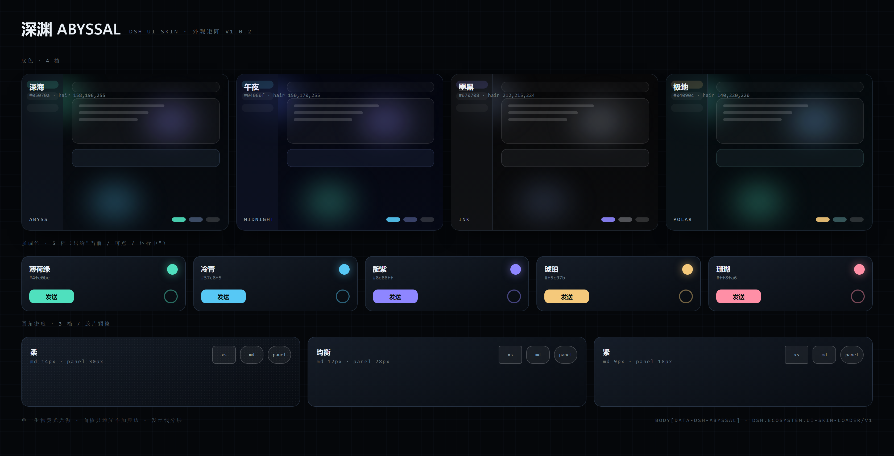

# 深渊 ABYSSAL · DSH UI 皮肤

[](https://github.com/topics/dsh-plugin)
[](https://github.com/deepseek-ai/deepseek-harness)
[](https://github.com/tenebris173/dsh-skin-abyssal/actions/workflows/test.yml)

> 近黑深海底 · 单一生物荧光光源 · 只透光不加厚边的玻璃

按 **`dsh.ecosystem.ui-skin-loader/v1`** 公约实现的 DSH 皮肤包。装好后出现在
**设置 → 皮肤** 的卡片墙里，与其它皮肤并列，一键切换。



## 运行模式：有控制台 / 没控制台都能用

本皮肤**不依赖任何第三方控制台**，自己就能跑：

| 场景 | 行为 |
| --- | --- |
| **没装皮肤控制台**（默认） | **自立模式**：装完重启即自动应用外观；在「设置 → 深渊」里可以开关、调全部选项（关掉立刻恢复原生界面，随时再打开） |
| 装了皮肤控制台（参考实现 `@dsh-eac/ui-skin-loader`） | 自动登记托管：出现在 **设置 → 皮肤** 卡片墙里，由控制台负责互斥切换 / 持久化 / 故障隔离 |

两种模式共用同一套 token 与设置存储，**切换控制台不需要改皮肤**。

### 对控制台 / 脚本的接口

皮肤实现了公约 `dsh.ecosystem.ui-skin-loader/v1` 的 `registerSkin()`；此外无论哪种模式，
都暴露一个统一入口供控制台或脚本驱动：

```js
window.__dshSkins["skins.abyssal"]
// {
//   mode: "standalone" | "console",   // 当前运行模式
//   skinId, version,
//   isActive(),                      // 是否正在生效
//   activate(), deactivate(),        // 手动开关（自立模式下 activate 会接管 owner）
//   getSettings(), setSettings(patch) // 读写外观设置
// }
```

自立模式下多款皮肤共存时用 `localStorage["dsh.skin.standalone.owner.v1"]` 协商归属：
先启动的占位，后启动的让位（设置面板里给「改用本皮肤」按钮，点击后刷新即接管）。

> 控制台是**可选**的第三方插件，不随本包分发。想要卡片墙式管理再装它即可。


## 这是一个 DSH 插件

本仓库是 [DeepSeek Harness](https://github.com/deepseek-ai/deepseek-harness) 的插件（皮肤类）。
按官方 README「Community and support」一节的要求，仓库已打上
[`dsh-plugin`](https://github.com/topics/dsh-plugin) topic，便于在
[github.com/topics/dsh-plugin](https://github.com/topics/dsh-plugin) 被发现；
`package.json` 的 `keywords` 与 `dsh.skin.tags` 里同样带 `dsh-plugin`。

三种安装方式，任选其一：

| 方式 | 命令 / 操作 |
| --- | --- |
| git（无需下载包） | `dsh plugin --profile desktop add https://github.com/tenebris173/dsh-skin-abyssal` |
| 美化包 | 从 [Releases](https://github.com/tenebris173/dsh-skin-abyssal/releases) 下 `ABYSSAL-UI-*.zip`，双击 `安装深渊皮肤.cmd` |
| 本地源码 | 见下方「安装 → B. 从源码装」 |

> 装完**必须重启 DSH**（插件包只在启动时进启动图），随后在 **设置 → 皮肤** 里一键切换。

## 外观

| 项 | 选项 | 默认 |
| --- | --- | --- |
| 底色 | 深海 / 午夜 / 墨黑 / 极地 | 深海 |
| 强调色 | 薄荷绿 / 冷青 / 靛紫 / 琥珀 / 珊瑚 | 薄荷绿 |
| 圆角密度 | 柔（14px）/ 均衡（原生）/ 紧（9px） | 柔 |
| 背景极光 | 强 / 柔 / 关 | 柔 |
| 胶片颗粒 | 开 / 关 | 开 |

4 × 5 × 3 × 3 × 2 = **360 种组合**，改档即时生效并跨重启保留
（皮肤自治：`localStorage`，键 `dsh.skin.abyssal.preferences.v1`）。

## 安装

### A. 用打包好的美化包（推荐给最终用户）

下载 release 里的 `ABYSSAL-UI-*.zip`，解压后双击 `安装深渊皮肤.cmd`。脚本会找到本机 DSH
（优先用你**正在运行**的那个），用官方途径装进 `desktop` profile，并把 `activeSkin` 切到本皮肤。

### B. 从源码装（开发）

```powershell
# 应用目录（默认装在当前用户的 LocalAppData 下；装在 Program Files 时改成对应路径）
$app = "$env:LOCALAPPDATA\Programs\DeepSeek Harness"
$cli = "$app\resources\app.asar\dsh\node_modules\@deepseek-ai\dsh-desktop-host\lib\cli.js"

# 以软链方式安装（改代码刷新即生效）
& "$app\DeepSeek Harness.exe" $cli plugin --profile desktop add "<本仓库绝对路径>"

# 卸载
& "$app\DeepSeek Harness.exe" $cli plugin --profile desktop remove dsh-skin-abyssal
```

装完**必须重启 DSH**（新增插件包只在启动时进启动图）。切换皮肤也可以直接在
**设置 → 皮肤** 里点，不必手改配置。

### C. 从 1.0.2 及更早升级

1.0.3 换了命名空间：皮肤 id 统一为 `skins.abyssal`，包名统一为 `dsh-skin-abyssal`
（旧值带个人标识，见 1.0.2 的 package.json）。旧 id 不会自动继承，需重装一次：

```powershell
# 1) 完全退出 DSH —— 运行中 pnpm 会报 ERR_PNPM_EPERM（node_modules 被占用）

# 2) 查出旧包名并卸掉（这里不重复写出旧值）
& "$app\DeepSeek Harness.exe" $cli plugin --profile desktop list | Select-String 'skin-abyssal'
& "$app\DeepSeek Harness.exe" $cli plugin --profile desktop remove <上面查到的旧包名>

# 3) 装新包
& "$app\DeepSeek Harness.exe" $cli plugin --profile desktop add "<本仓库绝对路径>"

# 4) 把 profile patch 里任何 *.skin.abyssal 形式的旧 id 换成新 id（改前先备份）
$patch = "$env:USERPROFILE\.dsh\profiles\desktop\cordis.patch.yml"
Copy-Item $patch "$patch.bak"
(Get-Content $patch -Raw) -replace '[\w.-]+\.skin\.abyssal', 'skins.abyssal' |
  Set-Content $patch -Encoding UTF8 -NoNewline
```

也可以直接双击美化包里的 `安装深渊皮肤.cmd` —— 它会把新包装上并把 `activeSkin` 切过来。

## 设计语言

1. **单光源** —— 整屏只有一组极光（左下强调色、右上靛紫、右下冷青），面板用半透明表面透出它，
   层级靠表面亮度而非阴影。
2. **发丝线分层** —— `rgba(158,196,255,.10)` 1px 描边 + 3% 白表面；永不加厚边。
3. **强调色纪律** —— 强调色只给「当前 / 可点 / 运行中」；成功 / 警告 / 危险保持独立语义色。
4. **仪表感** —— 元数据用等宽字体，数字 tabular。

## 实现要点

- **观感承载**：`theme.overrideTokens()` 覆盖宿主公开 token ——
  `--dsw-alias-*`(107)、`--dsw-specific-*`(11)、`--dsw-menu-*`、`--dsw-linear-*`、
  `--dsw-radius-*`、`--dsw-static-neutral(-bluish)-*` 中性灰阶。覆盖一律带 `!important`
  （宿主有内联 token）。
- **驱动宿主的亮暗开关**：宿主的亮暗分支是 `body[data-ds-dark-theme]`，而
  `--dsw-specific-input-major` 这类表面 token 只在暗色分支里有定义。皮肤是纯暗色，
  所以激活时置位该属性、退出时还原 —— 否则未覆盖的表面会落进 light 分支。
- **浮层实色兜底**：`[role="dialog"] / [aria-modal] / [role="menu|listbox|tooltip"]`
  强制实色 + 直角，保证弹窗永远不透出正文（用标准语义属性，不碰宿主私有类名）。
- **背景**：极光与颗粒画在 `body` 背景上（多层 `radial-gradient` + 内联 SVG 噪声），
  **不新增浮层**，因此没有 z-index / 层叠上下文风险。
- **自有节点**：只有一个 `<style data-skn-abyssal-style>` 与 `body[data-skn-abyssal]` 标记。
- **生命周期**（公约 §4.3 / R8）：activate 的每项副作用都登记 disposer，teardown 幂等；
  `deactivate` / `skinCtx.signal` abort / fiber 意外 dispose 三路汇合，退出后 token 与节点全部还原。
- **设置面板**：经 `settings.section` 席位注册 React 组件，只在皮肤激活时出现。

## 自测

```powershell
# 真实浏览器引擎里跑真实 bundle（需 Chrome 以 --remote-debugging-port=9222 启动）
node tests/browser-smoke.mjs

# 也可以指向任意构建产物
$env:SKIN_BUNDLE = "dist/package/lib/client.js"; node tests/browser-smoke.mjs
```

31 项断言：模块外壳 → `registerSkin` 载荷 → activate 副作用 → **真实 CSS 层叠**
（`getComputedStyle` 读 token 与背景是否真的生效）→ 改档即时重算 → teardown 净场。

### 端到端扫测（注入真实 DSH 页面）

```bash
# 1) 起一个 DSH 页面，记下打印的 URL
dsh web --no-open --port 0
# 2) 让 Chrome 开着 CDP
google-chrome --headless=new --remote-debugging-port=9222 --user-data-dir=/tmp/cdp about:blank
# 3) 跑
node tests/e2e-sweep.mjs "<上面那个 URL>" e2e-out
```

把 bundle 注入**正在运行的 DSH 页面**实跑一轮：激活副作用 → 逐档切换（真实 `getComputedStyle` 读值）→
CDP 模拟系统亮色 → 连切 10 次压力 → 真实设置弹窗 → `deactivate` 净场 → 二次激活 →
全程采集 `Runtime.exceptionThrown` 与 `console.error/warning`。

> 截图会存到 `e2e-out/`，**可能包含本机会话信息，不要外传**；`e2e-report.json` 里 URL 的 token 会自动打码。

## 目录

```
lib/index.js          宿主半（空 apply：观感全在 client 半）
lib/client.js         皮肤本体（登记 / token 表 / 外观面板 / 生命周期）
cordis.patch.yml      bundle patch（row id = 设置命名空间）
install/              一键安装 / 卸载脚本（美化包同款）
preview/              外观矩阵图 + 卡片预览 SVG
tests/browser-smoke.mjs
```

## 更新记录

见 [CHANGELOG.md](CHANGELOG.md)。

## 许可

MIT。
